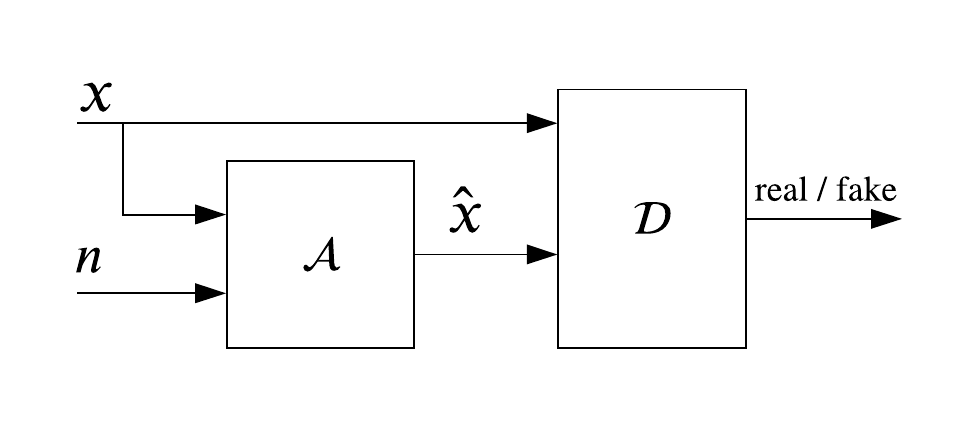

# Unsupervised Adversarial Augmenter/Generator Networks
This repository contains an implementation of an unspervised adverserial framework for both data augmentation and generarion.

## Table of contents
* [Generator](#generator)
* [Augmenter](#augmenter)
* [Usage](#usage)

## Generator
combining a variational autoencoder (VAE) with a generative adversarial network (GAN), we introduce a VAE-GAN netowrk that leverages unsupervised representation learning and data sample reconstruction.

	
## Augmenter
Given the adversarial training proposed for GANs, here we introduce an augmentation network thatgenerates multiple nonidentical augmented samples with identical class labels, called U-DAGAN.

The schematic of the proposed architecture for unsupervised data augmentation and the augmenter's architecture.

### Example
#### MNIST

#### snRNA-seq (FACS)

## Usage
Each **generator** and **augmenter** folder contains code for training the network and generating fakes samples.
To train the model you can use `run.py` to train the network and `*augmenter.py`/`*augmenter.py` to generate fake samples.

